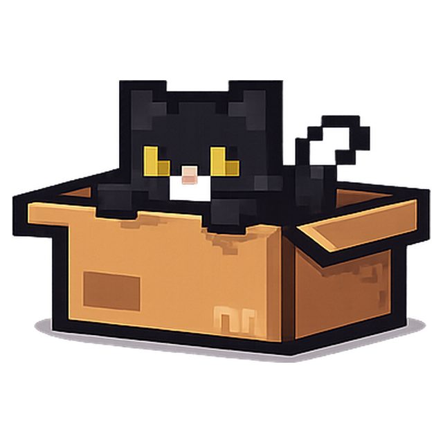

<p align="center">
  
</p>

# BugPet

BugPet is a native macOS desktop pet focused on coding presence, growth, and playful companionship.

BugPet 是一个原生 macOS 桌宠项目，围绕 coding 专注、成长反馈和更有生命感的陪伴体验展开。

## Download

- Website: [bp.eiddie.top](https://bp.eiddie.top)

## 下载

- 在线下载：[bp.eiddie.top](https://bp.eiddie.top)

## 中文

### 项目简介

`BugPet` 当前使用以下技术栈：

- `Swift`
- `AppKit`
- `SpriteKit`

当前版本已经包含：

- 透明悬浮宠物窗口
- 始终置顶显示
- 左键拖拽宠物
- 前台应用识别
- 系统空闲状态检测
- coding / focus 经验成长
- 右键控制面板
- 中英切换
- 白名单应用管理
- 深色模式适配
- TODO 面板
- 宠物选择与多槽位预留
- 专注贡献热力图
- 宠物状态气泡与基础动画

### 运行

在仓库目录执行：

```bash
swift run BugPet
```

如果只想先编译检查：

```bash
swift build
```

### 欢迎一起贡献

这个项目希望由大家一起把它做得更完整、更有趣。

欢迎贡献的方向包括：

- `debug` 和修复现有问题
- 添加新的宠物内容
- 优化交互体验
- 打磨动画表现
- 调整面板 UI / UX
- 改进数据统计与稳定性

如果你愿意参与，欢迎提 `Issue`、开 `PR`，或者直接一起讨论更好的实现方式。

### Roadmap

后续我会继续推进这些方向：

- 直接接入日志检测
- 更全面的数据统计
- 自定义宠物
- 成就系统
- 合成系统
- 更丰富的交互动画与反馈

### License

本项目采用 `MIT License` 开源，详见 [LICENSE](LICENSE)。

---

## English

### Overview

`BugPet` is currently built with:

- `Swift`
- `AppKit`
- `SpriteKit`

The current version already includes:

- Transparent floating pet window
- Always-on-top behavior
- Left-click drag interaction
- Foreground app detection
- System idle detection
- Coding / focus XP growth
- Right-click control panel
- Chinese / English switching
- Whitelist app management
- Dark mode support
- TODO panel
- Pet selection with future multi-slot support
- Focus contribution heatmap
- Status speech bubble and basic pet animations

### Run

Run the app from the project root:

```bash
swift run BugPet
```

Or build only:

```bash
swift build
```

### Contributions Welcome

This project is meant to grow with the community, and contributions are very welcome.

Helpful contribution areas include:

- debugging and bug fixes
- adding new pets
- improving interaction design
- polishing animation quality
- refining panel UI / UX
- improving stats and reliability

Feel free to open an `Issue`, submit a `PR`, or share ideas for where BugPet should go next.

### Roadmap

Planned future directions include:

- direct log-based detection
- more comprehensive stats
- custom pets
- achievement system
- fusion system
- richer interaction and animation polish

### License

This project is released under the `MIT License`. See [LICENSE](LICENSE).
